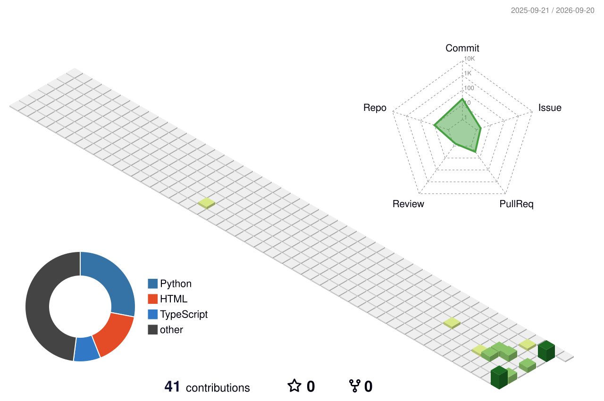

<div align="center">



<br/>

<a href="https://github.com/krithikraj199-eng">
  
</a>

# KIRUTHICKRAJ T

### `Aspiring Data Scientist / Data Analyst`

<p>
  
  
</p>

<a href="https://readme-typing-svg.demolab.com">
  
</a>

<p>
  
</p>

</div>

---

## `> ./identity --scan`

<table>
<tr>
<td width="58%" valign="top">

```text
╭─[ IDENTITY_NODE ]
│
├── NAME      : KIRUTHICKRAJ T
├── ROLE      : Aspiring Data Scientist / Data Analyst
├── DEGREE    : B.Tech — Artificial Intelligence & Data Science
├── MODE      : LEARNING • BUILDING • SHIPPING
├── CURRENT   : Data Science + DSA
├── BUILDING  : AI Agents & Intelligent Systems
└── STATUS    : OPEN TO INTERNSHIPS
```

I build at the intersection of **data, machine learning, intelligent automation and software**.  
My goal is to turn raw information into systems that can **analyze, reason, assist and create measurable value**.

</td>
<td width="42%" valign="top">

### `CURRENT_MISSION`

- 📊 Learning **Data Science**
- 🧩 Practicing **DSA**
- 🤖 Building **AI Agents**
- 🧠 Exploring **ML / DL / GenAI**
- ⚙️ Learning by building real systems
- 🚀 Improving one commit at a time

</td>
</tr>
</table>

---

## `> ./technology_matrix`

### `PROGRAMMING_CORE`

<p align="center">
  
</p>

### `AI_DATA_ENGINE`

<p align="center">
  
</p>

<p align="center">
  
  
  
  
</p>

### `BUILD_DEPLOY_TOOLKIT`

<p align="center">
  
</p>

---

## `> ./featured_systems --priority=high`

<table>
<tr>
<td width="50%" valign="top">

### 🛡️ [AGEIS Ω](https://github.com/krithikraj199-eng/AGEIS-)

**Autonomous monitoring & remediation system**

A local digital institution that models assets and dependencies, detects incidents, correlates symptoms, identifies root causes, evaluates remediation, executes policy-approved fixes on a digital twin, verifies outcomes and replans when needed.

`Agentic AI` `Monitoring` `Automation` `FastAPI` `React`

</td>
<td width="50%" valign="top">

### 🌿 [CropGuardAI Gen](https://github.com/krithikraj199-eng/cropguardaigen)

**AI-powered crop disease intelligence**

A crop-health system focused on disease prediction, intelligent analysis and practical guidance using AI/ML concepts for real-world agricultural decision support.

`Deep Learning` `Computer Vision` `AI/ML` `Python`

</td>
</tr>
</table>

---

## `> ./consistency_protocol`

<div align="center">

### 🔥 GitHub Contribution Streak

<a href="https://git.io/streak-stats">
  
</a>

### 🧩 LeetCode Progress Matrix

<a href="https://leetcode.com/u/Kiruthickraj__07/">
  
</a>

> **GitHub streak and LeetCode activity are separate.**  
> GitHub streak updates from qualifying GitHub contributions. LeetCode activity updates from your LeetCode submissions.

</div>

---

## `> ./github_intelligence`

<div align="center">


<br/>


</div>

---

## `> ./activity_stream --visualize`


<<div align="center">


</div>


---

## `> ./arcade_contribution_matrix --game=pacman`

<div align="center">

<picture>
  <source media="(prefers-color-scheme: dark)" srcset="https://raw.githubusercontent.com/krithikraj199-eng/krithikraj199-eng/output/pacman-contribution-graph-dark.svg">
  <source media="(prefers-color-scheme: light)" srcset="https://raw.githubusercontent.com/krithikraj199-eng/krithikraj199-eng/output/pacman-contribution-graph.svg">
  
</picture>

`PAC-MAN // CONTRIBUTIONS DETECTED // GHOST PROTOCOL ACTIVE`

</div>

---

## `> ./contribution_world --render=3D`

<div align="center">



</div>

---

## `> cat ACHIEVEMENT_LOG`

```text
╭─[ ACHIEVEMENT_LOG ]
│
├── 🚀 SIH 2026 .............. Team GeoNexis
├── 🐍 Python Internship ..... APPIN Technology
├── ☕ Java Internship ....... Study Shinee
├── 🎓 Java OOP .............. Udemy Certified
├── 🎯 Sparkathon 2026 ....... Organizer
└── 🤝 CSI ................... Member
```

---

## `> ./learning_signal`

```text
DATA        ███████████████░░░  analyzing
AI / ML     ██████████████░░░░  building
DSA         ███████████░░░░░░░  strengthening
AGENTS      ████████████░░░░░░  experimenting
SYSTEMS     ███████████░░░░░░░  expanding
```

> The bars above represent **learning focus**, not skill-percentage claims.

---

## `> ./network_links --connect`

<div align="center">

<a href="https://www.linkedin.com/in/kiruthickraj-t-235463351/">
  
</a>
<a href="https://leetcode.com/u/Kiruthickraj__07/">
  
</a>
<a href="https://www.hackerrank.com/profile/krithikraj199">
  
</a>

<br/>

<a href="https://devpost.com/krithikraj199?ref_content=user-portfolio&ref_feature=portfolio&ref_medium=global-nav">
  
</a>
<a href="https://x.com/onepiece_z_198">
  
</a>
<a href="https://www.instagram.com/genz__shxdow__/?hl=en#">
  
</a>
<a href="mailto:krithikraj199@gmail.com">
  
</a>

</div>

---

<div align="center">

### `SYSTEM_MESSAGE`

```text
> curiosity.exe       RUNNING
> consistency.service ACTIVE
> learning.loop       INFINITE
> build.mode          ENABLED
> next.version        LOADING...
```

**Learn deeply • Build boldly • Ship consistently**


</div>
